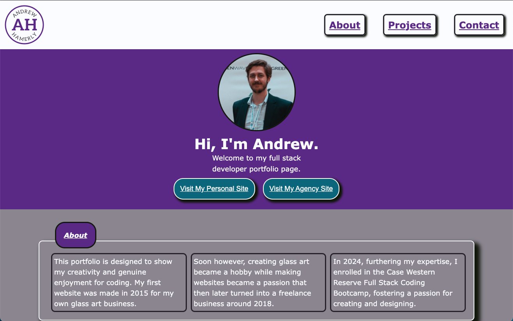

# Portfolio

## Description

This project was developed with the idea of pushing the limits of my own creativity. As a designer turned developer, I felt the desire to create a professional portfolio with some of my latest projects in a fashion that would highlight my latest added skills. This application provides a window into what a mixture of minimal design practices coupled with modern CSS can provide for responsive portfolio sites.

## Installation

To install this repo, simply copy the repo and use git clone in your command line along with the copied repo url with your preferred method.

```bash
git clone git@github.com:andrewhamerly/portfolio.git
```

## Usage

Useful for displaying recent full-stack portfolio work, my latest pet projects, and other important information regarding my full-stack developer journey.



Link to deployed application:
[Andrew Hamerly Portfolio Website](https://andrewhamerly.github.io/portfolio/)


## Credits

Thank you to Kevin Powell for the tip on adjusting scroll for a fixed navigation to avoid covering. His video can be found on Youtube here: [Stop fixed navigation covering content on scroll](https://www.youtube.com/watch?v=iGUSTyG-CYw)

## License

Source code is licensed under the MIT license.

Contents of this site are Copyright © 2024 Andrew Hamerly. All content rights reserved.
